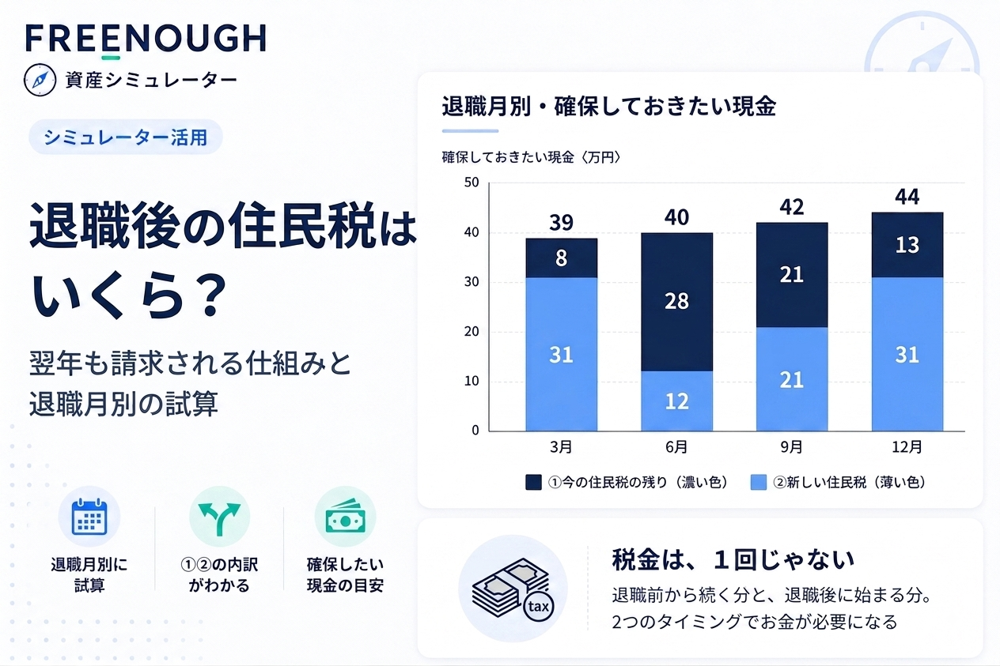
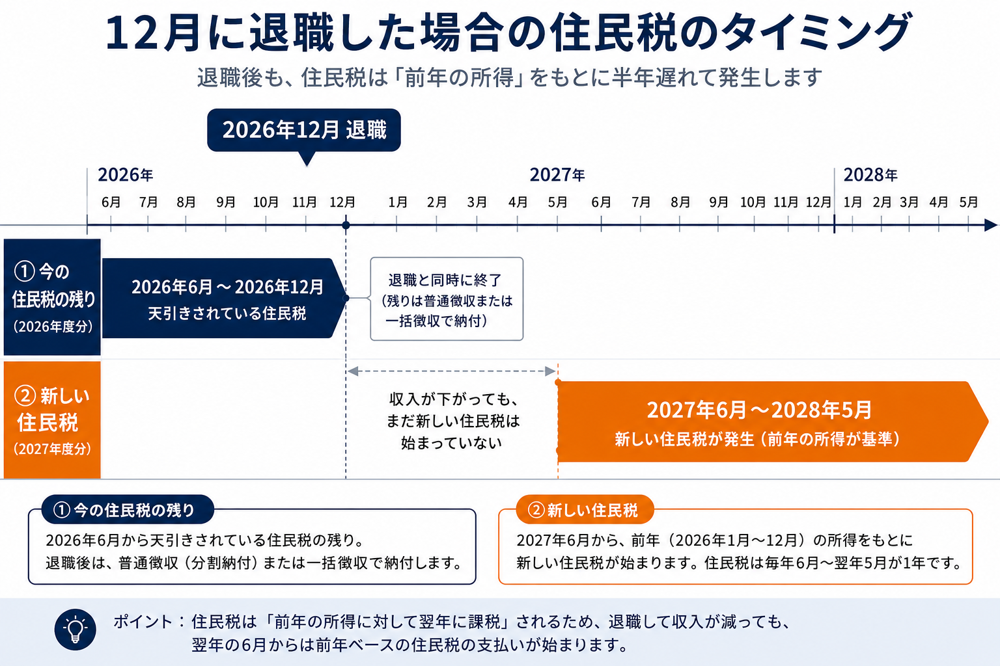
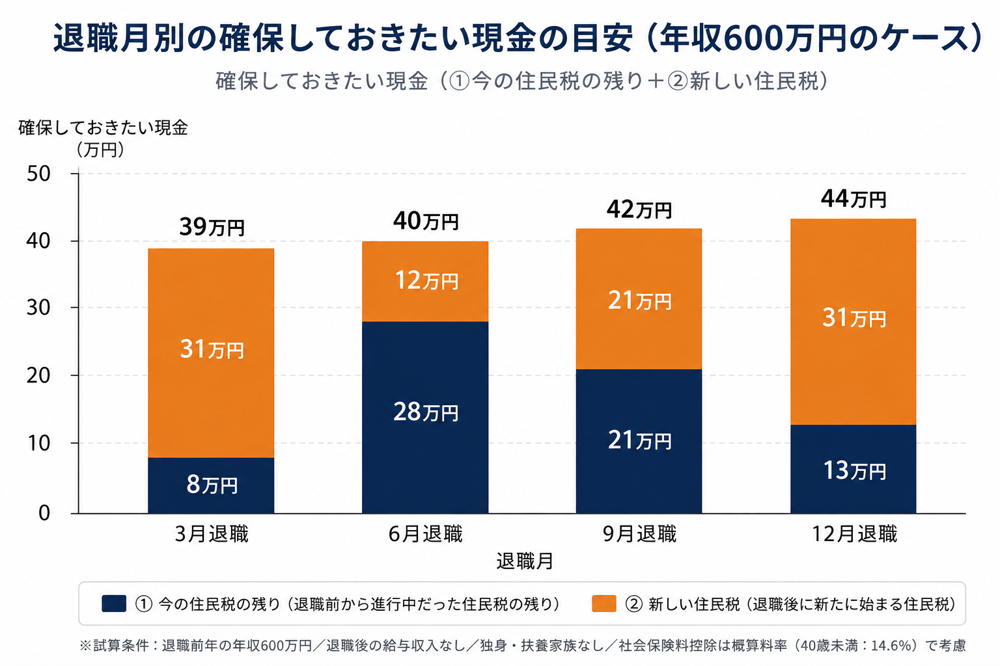

<!--
frontmatter(仮。実際のスキーマに合わせてKENZOさんの方で調整してください)
title: 退職後の住民税はいくら?翌年も請求される仕組みと退職月別の試算
slug: taishoku-yokunen-juminzei(仮)
category: シミュレーター活用(本番ツール〈resident-tax-timing〉の実出力を使用)
topics: iDeCo・退職金 または 年金・老後の資産計画(既存の在職老齢年金記事と同グループが妥当か要確認)
stages: 退職前後
publishedAt: (未定)
eyecatch: eyecatch-juminzei-taimurag.png(1536×1024px・作成済み)
-->

# 退職後の住民税はいくら?翌年も請求される仕組みと退職月別の試算

退職した翌年、収入がほとんどないのに住民税の請求だけがしっかり届く——。これは制度をきちんと理解していないと驚きやすいポイントです。住民税は「前の年の所得」をもとに翌年課税されるという仕組みのため、退職のタイミングによっては、収入が下がった年に前年ベースの重い請求が重なることがあります。

この記事では、退職後の住民税キャッシュフロー試算ツールを使って、退職月・年収別にどれくらいの住民税を見込んでおくべきかを試算します。

## この記事の結論

- 住民税は「前年の所得」をもとに、6月から翌年5月にかけて課税される仕組みです
- 退職すると、①退職前から進行中だった住民税の残り と ②退職後に新たに始まる住民税、という2つのタイミングでお金が必要になる場合があります
- 退職前年の年収600万円のケースで試算すると、退職月によって確保しておきたい現金の目安は39万円〜44万円の範囲になりました(退職後給与収入なし・独身・扶養家族なし・社会保険料控除を概算料率で考慮した場合)
- 1〜5月に退職する場合と6〜12月に退職する場合とで、住民税の基準になる年が変わるため、同じ年収でも内訳の見え方が異なります
- ツールに自分の年収・退職月を入力すれば、同じ考え方でご自身の目安を試算できます

## 住民税は「前年の所得」に対して「翌年課税」される

会社員の給与から天引きされる住民税は、実は前の年の所得をもとに計算されています。総務省の説明によれば、個人住民税は前年中(1〜12月)の所得を基準に、その年の6月から翌年5月にかけて特別徴収(給与天引き)されるという仕組みです。

つまり、今年6月から天引きされている住民税は、去年働いた分の精算にあたります。在職中はこのタイムラグをあまり意識せずに済みますが、退職するとこの構造がそのまま表面化します。

## 退職すると起きる「2つの波」

退職のタイミングで発生する住民税は、性質の異なる2つに分けて考えると整理しやすくなります。

**① 退職前から進行中だった住民税の残り**

退職する前から、6月始まりのサイクルで天引きされている住民税が既にあります。退職するとこの徴収が途中で止まるため、残りをどう納めるかという問題が生じます。1〜4月退職では強制的に一括徴収、5月退職はちょうど最後の1回で完了、6〜12月退職では分割納付(普通徴収)か一括徴収を選べます。

**② 退職後に新たに始まる住民税**

退職後、次の住民税年度が始まると、新しい課税が発生します。この基準になる所得は、退職月によって「退職前年」なのか「退職した年」なのかが変わります。1〜5月に退職する場合は、退職前年に1年間まるまる働いていた所得が基準になり、6〜12月に退職する場合は、退職した年に退職月まで働いた部分的な所得が基準になります。

この「①②の基準年が退職月によって変わる」という点は、試算する上でつまずきやすいポイントです。12月に退職した場合を例に、タイミングを図で整理すると以下のようになります。

収入が下がっても、退職の直後半年間は新しい住民税がまだ始まっていない、という空白期間があることが分かります。この空白期間があるために、油断していると翌年6月からの請求に驚きやすくなります。

まずは、自分の場合どれくらいの負担になりそうか、60秒ほどで確認してみてください。[退職後の住民税キャッシュフロー試算ツール](/asset-simulator/tools/resident-tax-timing?utm_source=blog&utm_medium=referral&utm_campaign=resident_tax_timing_blog)

## 退職月別に試算してみる(退職前年年収600万円)

退職後の住民税キャッシュフロー試算ツールで、退職前年の年収600万円・退職後の給与収入なし、というケースを、退職月を変えて試算しました(独身・扶養家族なし・社会保険料控除は概算料率〈40歳未満:14.6%〉で考慮)。

| 退職月 | ①今の住民税の残り | ②新しい住民税 | 合計(確保しておきたい現金) |
|---|---|---|---|
| 3月 | 8万円 | 31万円 | **39万円** |
| 6月 | 28万円 | 12万円 | **40万円** |
| 9月 | 21万円 | 21万円 | **42万円** |
| 12月 | 13万円 | 31万円 | **44万円** |

同じ年収でも、退職月によって①②の内訳がまったく違う形になっているのが分かります。

3月退職と12月退職は、②がどちらも31万円と同じ金額になっています。これは、1〜5月退職の②が「退職前年にまるまる1年間働いた所得」を基準にするため、3月退職でも12月退職でも(前年の年収が同じなら)②の金額が変わらないためです。一方で①は、3月退職の方が「進行中の徴収サイクルの残り月数」が少ないため、合計では3月退職の方が5万円ほど軽くなっています。

9月退職のように、退職までに働いた期間が長いほど、②の基準になる所得(=その年の部分的な稼ぎ)も大きくなり、②が徐々に重くなっていく傾向が見られます。

3月退職と12月退職で②(オレンジ色)が同じ高さになっている一方、①(紺色)の高さが違うために合計が異なっている、という点がグラフからも読み取れます。

## 年収別に見るとどう変わるか

同じ試算を、退職前年年収400万円・800万円でも行いました(いずれも退職後給与収入なし)。

| 退職月 | 400万円 | 600万円 | 800万円 |
|---|---|---|---|
| 3月 | 22万円 | 39万円 | 56万円 |
| 6月 | 22万円 | 40万円 | 59万円 |
| 9月 | 24万円 | 42万円 | 61万円 |
| 12月 | 25万円 | 44万円 | 64万円 |

年収が上がるほど、当然ながら確保しておきたい現金の目安も大きくなります。800万円・12月退職では64万円と、400万円・3月退職(22万円)のおよそ3倍の差が出ています。

## 確保しておきたい現金の考え方

試算した合計額の全てを、必ず自分の口座から別途用意しなければならないわけではありません。①のうち、1〜4月退職の強制一括徴収や、6〜12月退職で一括徴収を選んだ場合は、退職金や最終給与から自動的に差し引かれる想定です。退職金が十分にある場合、この分は「手取りが少し減るだけ」で済みます。

一方、②(退職後に新たに始まる住民税)や、分割納付(普通徴収)を選んだ場合の①は、基本的に自分の口座から納付する必要があります。退職金が少ない、またはない場合は、①の天引き想定分も含めて自己資金での準備が必要になる点に注意が必要です。

## 自分の場合を確認する

ここまでの試算は、独身・扶養家族なし・給与所得のみという前提で計算しています。配偶者控除や扶養控除がある場合、事業所得・不動産所得がある場合、ふるさと納税や住宅ローン控除を利用している場合は、実際の税額と異なります。

退職後の住民税キャッシュフロー試算ツールでは、ご自身の退職前年の年収・退職月を入力するだけで、同じ考え方で試算できます。「より正確に試算する」を開くと、社会保険料率や退職年の給与収入を実額で入力することも可能です。

[退職後の住民税キャッシュフロー試算ツールで試算する](/asset-simulator/tools/resident-tax-timing?utm_source=blog&utm_medium=referral&utm_campaign=resident_tax_timing_blog)

## よくある質問

**Q. 退職金からまとめて住民税が引かれる場合、何か手続きは必要ですか?**
1〜4月退職の場合は原則として自動的に一括徴収されます。6〜12月退職で一括徴収を希望する場合は、本人からの申し出が必要です。申し出がなければ、分割納付(普通徴収)に切り替わります。

**Q. 退職後、扶養に入ったり収入がゼロになったりしても住民税はかかりますか?**
かかる場合があります。住民税は前年の所得を基準にするため、退職した年の収入が少なくても、前年に一定以上の所得があれば、その分の住民税は発生します。

**Q. 転職してすぐに次の会社で働き始めた場合はどうなりますか?**
転職先で特別徴収(給与天引き)の手続きが引き継がれれば、給与から天引きされる形になる場合があります。このツールは退職後に別の給与収入がある場合の入力欄も用意していますが、天引きか自己納付かまでは判定していません。

**Q. 均等割や社会保険料の扱いはどこまで正確ですか?**
均等割は全国標準額、社会保険料控除は全国平均に近い概算料率を使っています。お住まいの自治体や加入している健康保険組合によって、実際の金額とは差が出ることがあります。

---

*本記事の試算は、退職後の住民税キャッシュフロー試算ツール(本番の計算ロジック)による実出力を使用しています。試算条件:独身・扶養家族なし・給与所得のみ・退職後給与収入0円・社会保険料控除は概算料率(40歳未満:14.6%)・2026年の税制に基づく。実際の税額は、扶養状況や自治体、退職年によって異なります。*
